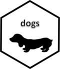

<!-- README.md is generated from README.Rmd. Please edit that file -->
dogs 
===============================================================

The goal of dogs is to demonstrate that dogs are man's best friend.

Installation
------------

You can install the released version of dogs from [GitHub](https://github.com/tomwestlake121/dogs) with:

``` r
devtools::install_github("tomwestlake121/dogs")
```

Example
-------

This is a basic example which shows you how to solve a common problem:

``` r
dogs::dogs_over_cats()
#> [1] "Woof woof!"
```
